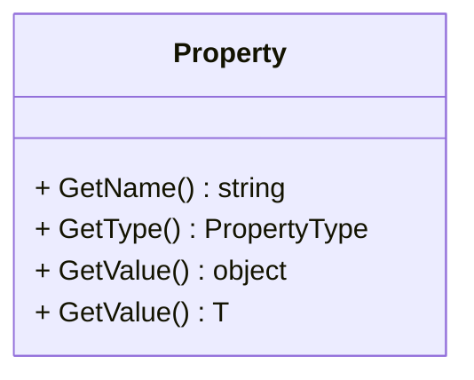

The idea is to create a property set for the entities that allows to stack
random set of [searchable] named values.

The idea

```mermaid

classDiagram
    class Property {
        + GetName() string
        + GetType() PropertyType
        + GetValue() object
        + GetValue<T>() T
     }


```